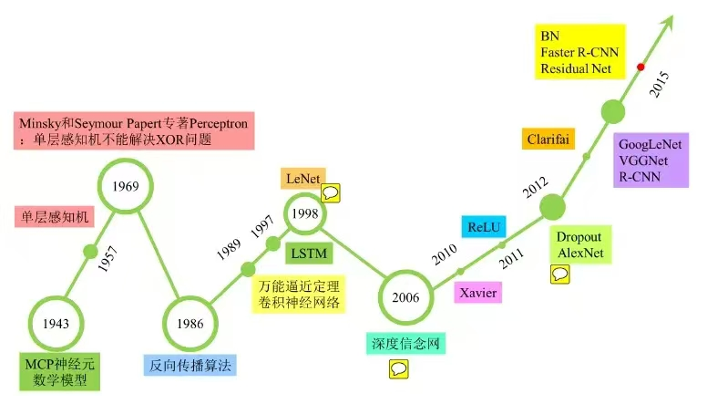
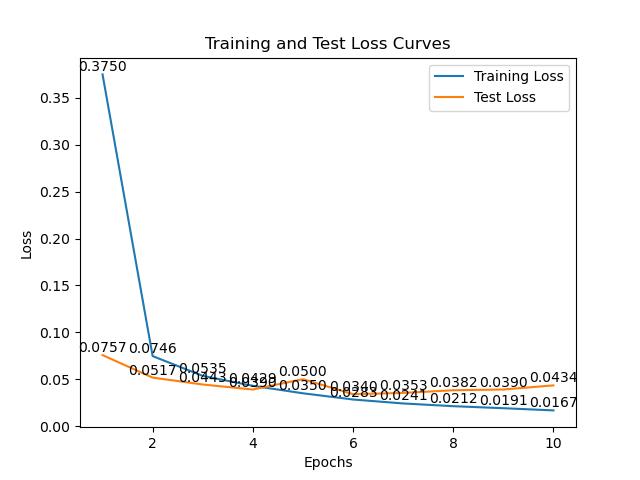
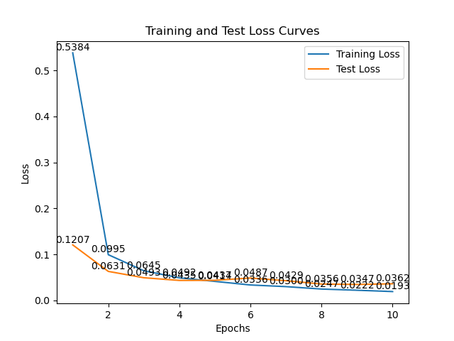
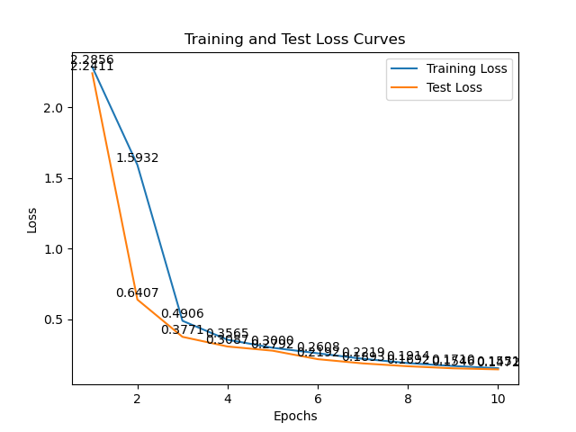
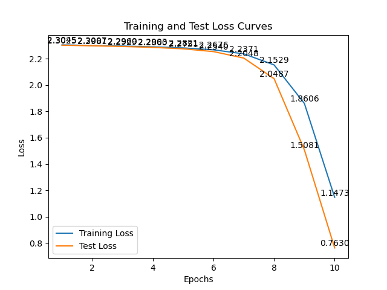
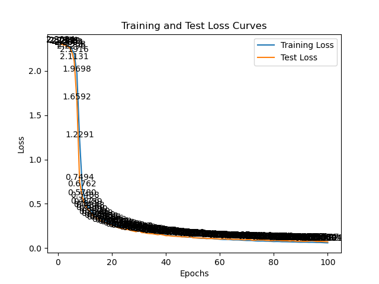

# LeNet5 考古

## 1. 背景

在RTX2080上复现了Yan Lecun 的LeNet5。以下是相关记录。

历史上看，LeNet属于CNN的开山之作。在其前后的大致发展如下图：

本次实验中的准确率与Yann Lecun论文中的数据不相上下（接近99%），但是计算资源变化很大：从每轮2-3天变为20秒，提升了1万倍。

复现经典的体会是站在今天看过去，犹如站在未来看现在。假设置身于20年后看现在，我们要以什么样的姿势参与到llm的浪潮中来？

## 2. 网络结构及参数规模

LeNet5是2层（卷积+池化）+2层全连接，激活函数使用ReLU。

输入是28*28的灰度图；
第一层卷积是6个核，卷积核大小5×5；随后跟随2×2大小的Avg池化；
第二层卷积是16个核，卷积核大小5×5；随后跟随2×2大小的Avg池化；
随后进入3层MLP，256->120->84->10
**总参数量**44,426

| Layer (type)        | Output Shape       | Param # |
| ------------------- | ------------------ | ------- |
| Conv2d (1, 6, 5x5)  | (batch, 6, 24, 24) | 156     |
| ReLU                | (batch, 6, 24, 24) | 0       |
| AvgPool2d (2x2)     | (batch, 6, 12, 12) | 0       |
| Conv2d (6, 16, 5x5) | (batch, 16, 8, 8)  | 2,416   |
| ReLU                | (batch, 16, 8, 8)  | 0       |
| AvgPool2d (2x2)     | (batch, 16, 4, 4)  | 0       |
| Flatten             | (batch, 256)       | 0       |
| Linear (256, 120)   | (batch, 120)       | 30,840  |
| ReLU                | (batch, 120)       | 0       |
| Linear (120, 84)    | (batch, 84)        | 10,164  |
| ReLU                | (batch, 84)        | 0       |
| Linear (84, 10)     | (batch, 10)        | 850     |

## 3. 数据集情况
*   **数据集：** MNIST 手写数字数据集
*   **训练集：** 60000 张图像
*   **测试集：** 10000 张图像
*   **数据预处理：**
    *   图像缺省大小为 28x28 大小
    *   将像素值归一化到 [0, 1] 范围

## 4. 训练环境
*   **硬件环境：**
    *   8核/48G
    *   GPU：NVIDIA RTX2080ti 11GB
    *   显卡计算能力: 单精13.45 TFlops / 半精26.9 TFlops
*   **软件环境：**
    *   操作系统：Ubuntu 22.04
    *   Python 版本：3.11
    *   深度学习框架：PyTorch 1.9.0

## 5. 训练过程及总结

训练采用交叉熵损失函数，使用随机梯度下降（SGD）优化器，其中初始学习率lr=0.01，momentum=0.9

训练过程尝试了4个batch_size：32、64、1024、4096。详细数据如下表，包括：每轮训练时间，loss，准确率等。
当batch_size=4096时，每轮的batch数只有12，训练的收敛速度明显降低。第一轮的准确率降到10.28%。后面我又做了实验，100轮之后准确率97.69%。从曲线上看也依然没有收敛。

| batch_size | 显存占用(M) | 每轮train 时长(秒) | epoch 1准确率 | epoch 3准确率 | epoch 10准确率 | 最终train loss | 最终test loss |
| ---------- | ----------- | ------------------ | ------------- | ------------- | -------------- | -------------- | ------------- |
| 32         | 240         | 19.86              | 97.56%        | 98.58%        | 98.89%         | 0.0167         | 0.0434        |
| 64         | 306         | 16.66              | 96.14%        | 98.46%        | 98.82%         | 0.0193         | 0.0362        |
| 1024       | 344         | 14.33              | 17.92%        | 88.54%        | 95.09%         | 0.1551         | 0.1472        |
| 4096       | 700         | 13.81              | 10.28%        | 10.28%        | 74.70%         | 1.1473         | 0.7630        |

从收敛过程看，batch_size=32时，在epoch 6开始过拟合，batch_size=64时，在epoch 5开始过拟合。下表是查看不同batch_size下训练的拟合情况。判断过拟合的标准是：如果train loss继续下降而test loss不降。

| batch_size | 过拟合时机 | train loss | test loss | test accuracy | 备注 |
| ---------- | ---------- | ---------- | --------- | ------------- | ---- |
| 32         | epoch 6    | 0.0283     | 0.0340    | 98.97%        |      |
| 64         | epoch 5    | 0.0414     | 0.0437    | 98.66%        |      |
| 1024       | 没有过拟合 | 0.1551     | 0.1472    | 95.09%        |      |
| 4096       | 欠拟合     | 1.1473     | 0.7630    | 74.7          |      |

总结下来：

训练过程中挑选最佳效果是在batch_size=32，训练epoch=6时，达到最佳效果：

***准确率=98.79%*** 作为对比，杨立坤在其

训练时间是每轮19.86秒，共6轮。***总时长≈120秒*** 

训练过程占用显存240M，没有造成任何负担。

## 6. 对比

训练时间和成本大幅下降：每轮的时间从2-3天到20秒。

| 对比 | 准确率 | 训练时长 | 硬件环境 |
| -------- | ----- | ----- | ----- |
| 本项目 | 98.97% | 每轮20秒，共6轮，总时长：2分钟 | Silicon Graphics Origin 2000 ，配备单个 200MHz R10000 处理器 |
| LeCun et al. (1998) | 99% | 每轮2-3天，总时长40-50天 | nvidia rtx2080 |

从网络结构上看，LeNet5的结构相对简单，参数44426，与2012年的AlexNet的60M参数相比，相差1000多倍。直观感受如下：

| 特征           | LeNet-5                                  | AlexNet                                  |
| -------------- | ---------------------------------------- | ---------------------------------------- |
| **发布时间**   | 1998                                     | 2012                                     |
| **作者**       | Yann LeCun et al.                        | Alex Krizhevsky et al.                   |
| **主要应用**   | 手写数字识别                             | 图像分类                                 |
| **网络结构**   | 较浅的网络，包含卷积层、池化层和全连接层 | 较深的网络，包含卷积层、池化层和全连接层 |
| **卷积核大小** | 较小（5x5）                              | 较大（11x11, 5x5, 3x3）                  |
| **激活函数**   | Sigmoid, Tanh（本实验中用ReLU）          | ReLU                                     |
| **池化层**     | 平均池化                                 | 最大池化                                 |
| **正则化**     | 无                                       | Dropout                                  |
| **数据增强**   | 无                                       | 图像平移、翻转等                         |
| **GPU**        | 无                                       | 使用 GPU 加速训练                        |
| **参数量**     | 约 4.4 万（44426）                       | 约 6000 万                               |
| **复杂度**     | 较低                                     | 较高                                     |

## 7. 代码

https://github.com/brucezhao1875/Legacy-Models/tree/main/LeNet5

## 8.附录 训练结果曲线

如下是batch_size=32,训练10个epoch的数据：train loss 始终下降，test loss 在epoch 6之后不再下降。
所以认为在epoch 6时出现过拟合。

如下是batch_size=64,训练10个epoch的数据：在epoch 5 时train loss 和 test loss交叉。

如下是batch_size=1024,训练10个epoch的数据。batch_size这么大，数据变得平滑了，所以一直没有过拟合现象发生。test_loss和train loss都一直在下降

如下是batch_size=4096,训练10个epoch的图形，严重欠拟合。

因为batch_size=4096时10个epoch训练的结果严重欠拟合，因此这里把epoch设为100，看看训练效果。可以看到100个epoch还是欠拟合。最后一轮的数据如下:Epoch [100/100], Train Loss: 0.0591, Test Loss: 0.0704, Test Accuracy: 97.69%, Time: 13.64 seconds

